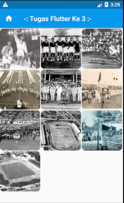
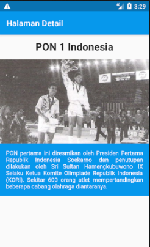

# Flutter Basic Tugas 3 ( Tugas 3 - OSG08 )
Aplikasi Flutter Sederhana dengan ketentuan:

1. Terdapat minimal 2 halaman (utama dan detail).
2. Menggunakan widget GridView pada halaman utama untuk menampilkan data berupa gambar (minimal 10 data).
3. Ketika item di klik akan berpindah ke halaman Detail dan menampilkan data sesuai item yang di klik.
4. Pada halaman Detail minimal terdapat widget Image dan Text.
5. Gambar boleh berupa Image Assets maupun Image Network.
6. Aplikasi bertemakan tentang olahraga (dalam rangka memperingati Hari Olahraga Nasional).
4. Edit file README.MD dengan yang sudah di tentukan.
5. Upload project tersebut ke dalam Github, kirim tugas berupa link repository tersebut.

Tips tambahan,
- Kamu bisa gunakan widget InkWell untuk membungkus item (Card/Image/semacamnya) agar item dapat menerima fungsi sentuhan (onTap, onLongPress, onDoubleTap, dll).

### Screenshot
 

### Built With
- [Flutter](https://flutter.dev)

### Created By
- Tomy Dwi

### Online Study Group Eudeka!
Salah satu program dari [**Eudeka!**](https://www.eudeka.id) untuk belajar secara _full online_ via Whatsapp/Telegram dan Google Classroom, dengan para praktisi handal di bidangnya. Selain itu juga kamu dapat berkesempatan untuk memperluas koneksimu dengan peserta lain.

### OSG08 - Flutter Basic
Dengan jangka waktu lebih kurang 2 bulan, peserta diharapkan dapat mengenal dan membuat aplikasi simple Flutter dengan menggunakan data dari internet (API).

### Cara Mendaftar Online Study Group
Untuk pendaftaran kelas selanjutnya, silahkan kunjungi atau hubungi kami di dawah ini.

### Info Lebih Lengkap
Website : [www.eudeka.id](https://www.eudeka.id)  
Twitter: [@EudekaID](https://twitter.com/EudekaID)  
Telegram : [@eudekainfo](https://t.me/eudekainfo)  
Instagram : [@eudeka.id](https://instagram.com/eudeka.id)  
WhatsApp : [0895351577557](https://wa.me/62895351577557)  
Email : [info@eudeka.id](mailto:info@eudeka.id)  

---

###### tags: `Flutter` `Eudeka` `OSG08`